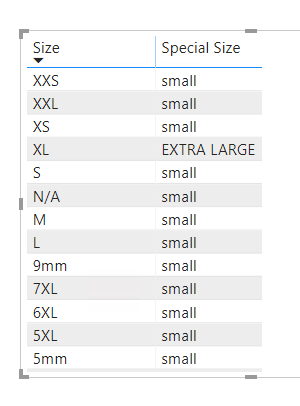

# Introduction to DAX

You've just seen some examples of how DAX works. We will explore DAX further later on in this course. For now, let's try some DAX.

## Calculated Measures

1. On your lab environment, open the folder `dax-powerbi-ssas`. It is located on your Desktop.
2. Inside the folder `01-instroduction-to-dax`, open the file `01-start-simple-star-fact-sale`
3. Drag the column **Total including Tax** onto your report canvas
4. Add the **Calendar Year** column to the axis to see the Total Including Tax by Calendar Year. Your chart should look like this:


This is an *implicit measure*.

5. Now, create an explicit measy with the name **Sum of Total Including Tax**, which has the same behaviour as the implicit measure above. You can use the `SUM` formula for this.

## Calculated Columns

Inside **Dimension Customer** is a **Primary Contact** as well as a **Customer** name. For display purposes, our customer would like to have one column with a specific text format. It should look like this:


6. Create a new calculated column to achieve this. You might need the following information:
   * To enter a text directly, use double quotes: `"`
   * To combine two texts, use an ampersand: `&`
7. The customer now wants a column `special size` inside the table `Dimension Stock Item` as well. It should display "EXTRA LARGE" whenever the `size` column is XL. For all other sizes (including `N/A`) it should display "small".
   * Use an `IF` statement for this
   * If you need any assistance, feel free to ask for help!



For the next item, you will need a **nested** IF - which means you can plug one IF statement inside another. If you wonder how to solve this, try to add this column first:

```dax
IF([Size] = "L", "Large", IF([Size] = "XL", "Extra Large", "Others"))
```

8. Add another column titled `extended size` inside the table `Dimension Stock Item`. 
   * If `Size` is `XL`, it should display "Extra Large"
   * If `Size` is `L`, it should display "Large"
   * Otherwise, it should display "Other"

If you're up to a challenge, let's make this a little bit harder. You will need to use the **logical operators** for the next assignment:

9. Add another column called `special tax size` inside the table `Dimension Stock Item`.
   * It should display "Large, High Tax" when size is "L" or "XL" and Tax Rate is greater than 10
   * It should display "Large, Low Tax" when size is "L or "XL" and Tax Rate is lower than or equal to 10
   * It should display "Other" in all other cases


## Calculated Table

You can use the `FILTER` DAX statement to filter a table, and return a new table (containing only the filtered content). One example of this is presented earlier:

```dax
Dates2 = FILTER(Dates, 'Dates'[Calendar Year] = 2016)
```

10. Create a Calculated Table with the name `Medium-Small Stock Items`. It should be a filtered edition of the `Dimension Stock Item`, where only products with size `S` and `M` are included.