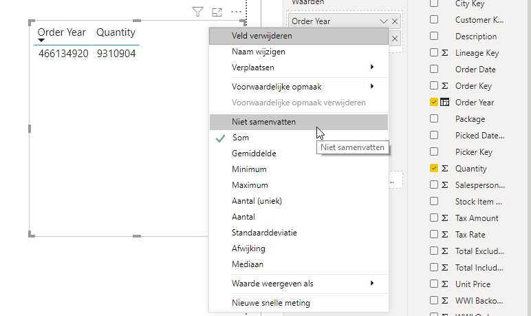
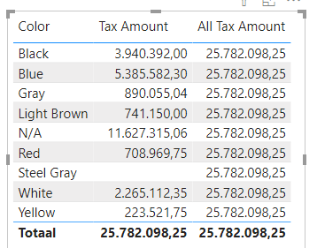

# Demo: Functies, queries en categorieën

> In deze training zijn de demo's iets anders dan je normaal gesproken gewend bent: in plaats van een trainer die een demonstratie geeft, hebben we ervoor gekozen om de demonstratie uit te schrijven, waarna je de demonstratie feitelijk zelf geeft. Op die manier blijven sommige zaken zo beter hangen, en is er minder kans dat je iets mist. Bijkomend voordeel: je kunt de demonstratie er later eenvoudig weer eens bijpakken om iets te demonstreren of uit te leggen.

## Voorbereiding en scope

In deze demo gaan we kijken naar wat DAX eigenlijk is. We bekijken daarvoor naar twee zaken:

1. **Functies binnen DAX**. Zoals eerder uitgelegd heeft DAX acht verschillende functiecategorieën. We bekijken van alle categorieën één of meer voorbeelden van functies.
2. **DAX als query-taal**. We maken kennis met de tool **DAX Studio**, waarmee we DAX queries kunnen "afluisteren" van Power BI of Analysis Services, maar ook zelf DAX queries schrijven.

Er staat al een Power BI-bestand klaar waar we in deze demo mee zullen werken - het bestand heet `02-demo-functies-queries-categorieen`. Open dit bestand om met de demo aan de slag te kunnen

## Voorbeelden van functies

DAX heeft acht verschillende functiecategorieën:

* DateTime
* Filter
* Information
* Logical
* Math and trigonometry
* ParentChild
* Statistical
* Text

Om hier wat gevoel bij te krijgen zullen we van elke functie twee of drie voorbeelden bekijken van functies.

### DateTime

#### YEAR()

DateTime-functies kunnen je helpen om datums en tijden te verwerken. Stel dat je bijvoorbeeld de hoeveelheid verkochte producten per jaar wilt weergeven.

1. Uit de tabel **Order** selecteer je het veld **Order Date**. Op je canvas zie je nu een tabel met één kolom, waarin de datums staan waarop de producten verkocht zijn.
2. Sleep nu vanuit de tabel **Order** het veld **Quantity** op de lijst met datums.

De tabel laat nu de verkopen per dag zien, maar we willen graag de verkopen per *jaar*. Om dit te bereiken voegen we een **calculated column** toe.

3. In het paneel met **velden** aan de rechterkant van je scherm selecteer je de tabel **Order**.
4. In het lint (de ribbon) bovenin zie je dat je automatisch naar het kopje **Tabelhulpmiddelen** gebracht wordt. Hier heb je de mogelijkheid om een nieuwe kolom toe te voegen.
5. Klik op **Nieuwe kolom**. Onder het lint verschijnt de DAX-editor. De tekst `Kolom = ` staat weergegeven
6. Vervang deze tekst door `Order Year = YEAR([Order Date])`
7. Maak nu een tweede tabel, waarin je `Order Year` en `Quantity` naast elkaar zet.

Power BI zal standaard proberen elke numerieke waarde op te tellen (tenzij je in het model hebt aangegeven dat dit niet de bedoeling is). Zo ook `Order Year`. Gelukkig kun je dit vrij eenvoudig aanpassen: klik de tabel die je zojuist gemaakt hebt, en klik onder het kopje **Waarden** op het pijltje naast **Order Year**. Kies nu voor **Niet samenvatten**:

> Naast de functie `YEAR` zijn er ook diverse soortgelijke functies die bijvoorbeeld maanden of dagen uit een datum ophalen. Een paar voorbeelden:
> 
> * **DAY** geeft het dagnummer binnen een maand (1-31)
> * **MONTH** geeft het maandnummer terug (1-12)
> * **YEAR** geeft het jaar terug
>
> Op dezelfde wijze kun je **QUARTER**, **WEEKDAY**, **HOUR**, **MINUTE** en **SECOND** gebruiken. Er is ook een **WEEKNUM** functie, maar let daar even goed op de weeknummering: in Europa gebruiken we een andere weeknummering dan in de V.S.!)

#### DATEDIFF en EOMONTH

Stel nu dat we voor elke datum zouden willen berekenen hoeveel dagen er nog over zijn tot het einde van de maand. Dat vereist twee stappen:

* We moeten weten wanneer het einde van de maand is (iets dat in februari niet heel eenvoudig is)
* We moeten uitrekenen hoeveel dagen er tussen een gegeven datum en de laatste datum binnen de maand zitten

Gelukkig heeft DAX een functie aan boord om ons te helpen met het eerste probleem. De functie **EOMONTH** vertelt ons altijd wat het einde van de maand is.

8. Maak een **Nieuwe kolom** in de tabel **Order**. Geef deze de definitie `End of Order Month = EOMONTH([Order Date], 0)`.
9. Voeg deze kolom toe aan de tabel waarin je `Order Date` tegen `Quantity` had uitgezet (dus de allereerste tabel).
10. Je ziet nu voor elke weergegeven `Order Date` wat de laatste dag is in de betreffende maand:

> Zoals je ziet heeft de EOMONTH-functie twee argumenten: de datum, en een `0`. Het tweede argument verteld hoeveel maanden je vooruit wilt kijken. Dit geeft je de mogelijkheid om niet alleen de laatste dag van de huidige maand te bekijken, maar ook de laatste dag van de volgende maand (`EOMONTH([Order Date], 1)`).

11. Maak een **Nieuwe kolom** in de tabel **Order**. Geef deze de definitie `Days until end of Order Month = DATEDIFF([Order Date], [End of Order Month], DAY)`.
12. Voeg deze kolom toe aan de tabel waarin je zojuist ook `End of Order Month` hebt toegevoegd.
13. Omdat `Days until end of Order Month` opnieuw een numerieke waarde is, zal Power BI deze proberen te aggregeren. Zorg ervoor dat dit niet meer gebeurt.
14. Herschik de kolommen zodat `Quantity` als laatste kolom wordt weergegeven.

Je ziet nu voor elke orderdatum hoeveel er besteld is, evenals hoeveel dagen er nog over zijn in de maand.

### Filter

Filter functies zijn één van de meer complexe functies binnen Power BI. Om de demonstratie niet te diepgaand te laten zijn (we gaan later uitgebreid in op filters en wijden er zelfs een hele module aan) volgt hier een kort voorbeeld. We willen hierin een analyse doen van de betaalde belasting per kleur van het product dat we verkochten:

15. Maak een nieuw tabblad aan, geef deze de naam **Filter**
16. Sleep uit de tabel **Stock Item** het veld **Color** op het canvas. 

Op het canvas verschijnt nu een tabel met één kolom. Daarin staan de kleuren van de verkochte producten.

17. Sleep uit de tabel **Sale** het veld **Tax Amount** bovenop de zojuist aangemaakte tabel.

De tabel geeft nu per productkleur aan hoeveel belasting hiervoor betaald is. Wanneer je dat iets technischer uitdrukt, zou je kunnen stellen dat de tabel **Sale** *gefilterd* wordt op elke kleur (Black, Blue, Gray, ...) en dat er in de kolom **Tax Amount** vervolgens alleen een optelling van de rijen van die kleur wordt gedaan.

Met de functie **ALL** kunnen we de filters van een tabel vervolgens verwijderen:

18. In het paneel met **velden** aan de rechterkant van je scherm selecteer je de tabel **Sale**.
19. In het lint (de ribbon) bovenin zie je dat je automatisch naar het kopje **Tabelhulpmiddelen** gebracht wordt. Hier heb je de mogelijkheid om een nieuwe meting (measure) toe te voegen. 
20. Klik op de knop **Nieuwe meting**
21. Vervang de tekst `Meting =` door de DAX-formule `All Tax Amount = CALCULATE(SUM([Tax Amount]); ALL('Order'))`
22. Voeg de kolom `All Tax Amount` toe aan de tabel met `Color` en `Tax Amount`.

Je hebt nu een tabel waarin op elke rij de betaalde belasting voor een kleur wordt weergegeven, evenals het totaal aan betaalde belasting. De functie `ALL` heeft er hier voor gezorgd dat de "filter" op kleur verwijderd werd.

> Zoals hierboven gesteld zijn filter functies de meer complexe functies binnen Power BI. Tegelijkertijd zijn ze de crux tot écht krachtige Power BI modellen en uitgebreide measures. Wanneer je de zaken hierboven slechts globaal volgde, is dat geen probleem - we komen hier later nog uitgebreider op terug.

### Information

### Logical

### Math and trigonometry

### ParentChild

### Statistical

### Text

### Negen functiecategorieën?

Eerder stelden we dat er acht functiecategorieën zijn in DAX. DAX onderscheidt echter nog een negende functiecategorie, die we hier niet bespreken: **Time-intelligence** functies. Hoewel deze strikt gezien ook onder **Date & Time** zouden kunnen vallen, zijn deze functies vaak iets ingewikkelder. Voor een goed overzicht is er daarom in de documentatie voor gekozen om ze te scheiden. Gebruikers die in het lijstje met datum-functies `EOMONTH` tegenkomen, worden dan niet in de war gebracht met de "time intelligence" functie `ENDOFMONTH`. 

De Time Intelligence functies voeren voor nu te diep - verderop in de cursus zullen we deze echter zeker behandelen!

## DAX als Query-taal