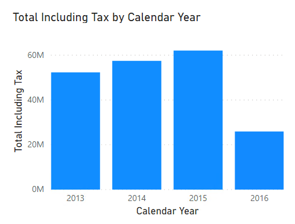

# Measures, calculated columns en tables

In de vorige demo hebben we gekeken naar hoe DAX werkt. Daar zijn al diverse **measures**, **calculated columns** en **tables** voorbijgekomen. In dit *mini-lab* gaan we hier nog wat verder op door.

## Calculated Measures

1. Open de map `dax-powerbi-ssas`. Deze bevindt zich op het bureaublad van je cursus-VM
2. Binnen de map `01-introduction-to-dax` open je het bestand `08-mini-lab-measures-calccolumns-tables-start`
3. Sleep the kolom **Total including Tax** naar het canvas
4. Voeg de **Calendar Year** kolom aan de as van de grafiek toe om *Total Including Tax per Calendar Year* weer te geven. Je grafiek zou er nu als volgt uit moeten zien:



Je hebt zojuist gebruik gemaakt van een *implicit measure*: Power BI bedenkt onder water de DAX-query die nodig zou zijn zodat *Total including Tax* zich als measure kan gedragen.

5. Maak nu een **expliciete measure** aan met de naam **Sum of Total Including Tax**. Deze moet hetzelfde werken als de impliciete measure die je tot nu toe gezien hebt. Hiervoor kun je de `SUM` formule gebruiken.

## Calculated Columns

Binnen **Dimension Customer** is zowel een kolom **Primary Contact** (met de naam van een contactpersoon) als een kolom **Customer** (met de bedrijfsnaam). Onze klant wil graag één kolom waar allebei deze waarden instaan, in een specifiek tekstformaat. Het moet er als volgt uitzien:


6. Maak een nieuwe *calculated column* om dit te bereiken.
   * Om tekst direct in te voeren gebruik je dubbele quotes `"`
   * Om twee teksten te combineren gebruik je het ampersand-teken: `&`
7. De klant wil ook graag een kolom `special size` in de tabel `Dimension Stock Item`. Deze moet de tekst "EXTRA LARGE" wanneer de `size` kolom de waarde "XL" heeft. Voor alle andere formaten (inclusief `N/A`) moet de tekst "small" worden weergegeven.
   * Gebruik hier de `IF` functie
   * Vraag gerust om ondersteuning!


Voor de volgende opgave heb je een zogenaamd **geneste** IF functie nodig. Dat betekent dat je één IF-statement kunt gebruiken *binnen een ander IF-statement*. Hier een klein voorbeeldje hoe dat kan werken - het kan handig zijn om hiermee te starten, en het vervolgens in kleine stapjes uit te werken naar de opgave:

```dax
IF([Size] = "L", "Large", IF([Size] = "XL", "Extra Large", "Others"))
```

8. Voeg binnen de tabel `Dimension Stock Item` een kolom toe met de naam `extended size`.
   * Als `Size` gelijk is aan `XL` moet in deze kolom "Extra Large" staan
   * Als `Size` gelijk is aan `L` moet er "Large" staan
   * In alle andere gevallen staat er "Other"

Mocht je behoefte hebben aan wat meer uitdaging, dan kunnen we deze nog iets moeilijker maken. Voor de volgende opgave heb je zogenaamde **logische operators** nodig (dit is een bonus-opgave - mocht je er niet uitkomen: we gaan hierna vrij snel aan de slag met deze operators):

9. Voeg een kolom met de naam `special tax size` toe binnen de tabel `Dimension Stock Item`. De waarde is als volgt:
   * "Large, High Tax" wanneer 'size' gelijk is aan "L" of "XL" en 'Tax Rate' groter dan 10
   * "Large, Low Tax" wanneer 'size' gelijk is aan "L of "XL" en 'Tax Rate' kleiner dan of gelijk aan 10
   * "Other" in alle andere gevallen.


## Calculated Table

Je kunt de `FILTER` functie gebruiken om een filter te leggen op een tabel. De resultaten komen dan als een nieuwe tabel terug, die alleen de gefilterde inhoud bevat. Een voorbeeldje hiervan is deze **Calculated Table** waarin alleen de datums uit 2016 opgenomen zijn:

```dax
Dates2 = FILTER(Dates, 'Dates'[Calendar Year] = 2016)
```

10. Maak een Calculated Table met de naam `Medium-Small Stock Items`. Het moet een gefilterde versie zijn van `Dimension Stock Item`, waar alleen producten met size `S` en `M` zijn opgenomen.
