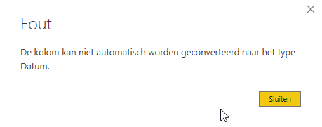

# Datatypes

In this *mini-lab*, we will work with datatypes in DAX. For this purpose, we have chosen a file where all datatypes are deliberately set as *text*. We are going to make some changes to the data model.

## Numbers vs. Text - storage

0. View the Power BI file `09-datatypes-mini-lab` with Windows Explorer. Note that the file is currently 5.89 MB (6,042 kB) in size.
1. Open the Power BI file `09-datatypes-mini-lab`.
2. Switch to the **Data** view within Power BI.
3. Select the **Order Key** column.
4. Set the **Data type** to **Whole Number**. Confirm that you want to do this.
5. Save the file again and check the file size with Windows Explorer. Note that the file is now almost 10% smaller - approximately 5.27 MB (5,402 kB).

Also change the following columns to **Whole Number**:

* City Key
* Customer Key
* Stock Item Key
* Salesperson Key
* Picker Key
* WWI Order ID
* Quantity

When you view the file now with Explorer, you will see that it has indeed become slightly smaller, but not by much (about 5.21 MB / 5,346 kB). The reason for this is twofold:

* Numbers generally take up less space than text. That's why the files are getting smaller each time.
* Power BI stores data per column. We will look at what that exactly means later, but we can give you a little hint: if values occur multiple times, they do not take up twice as much space.

**Order Key** was a column with 231,412 unique values - when you switch from text to number storage, it has a significant impact. 

## Dates and times
6. Set the column **Order Date** to the data type **Date**. Note that you can also choose a format - select 'dd-mm-yy' (14-03-01) here.
7. Now try to set the column **Picked Date Key** to **Date**. You will receive the following error message:



The reason this fails is that there is an **empty text value** present in the column. And although a "true" missing value (`BLANK` in Power BI) is not a problem (it can exist in a date column as well), an empty text is an invalid date.

8. Rename the column **Picked Date Key** to **Picked Date Key SOURCE**.
9. Create a new column **Picked Date Key** with the following definition:

```dax
Picked Date Key = IF([Picked Date Key SOURCE] = "", BLANK(), [Picked Date Key SOURCE])
```

10. Now try to set this new column **Picked Date Key** to the **Date** data type. Hide the old column for the report view.
## Decimal numbers

11. Set the **Unit Price** column to the **Fixed Decimal Number** data type. Choose a **Currency** format, with two decimal places.

> If step 11 fails, it's because a period is being used as the decimal separator (so it says 13.00, but according to a Dutch Windows installation it should be 13**,**00). Follow the same pattern as above for this:
>
> * Rename the **Unit Price** column to **Unit Price SOURCE**
> * Create a new column **Unit Price**
> * Use the DAX function **SUBSTITUTE** to replace the period with a comma
> * Now try to save the new column as **Fixed Decimal Number**
> * **Hide** the **Unit Price SOURCE** column
>

## Recap

We have just made some adjustments to our data model regarding data types. However, most data type adjustments are done during data loading - not in your DAX data model. This can be done, for example, in the ETL process of your data warehouse or in a Power Query definition within Power BI or Analysis Services. It is much easier to exclude empty values, replace periods with commas, and consider regional settings of a source file there. And you don't have to include the "underlying" columns (which we have now labeled with **SOURCE**) in your model. This keeps your model clear, smaller, and faster.
