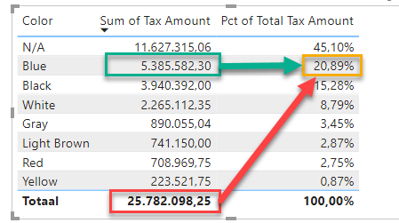
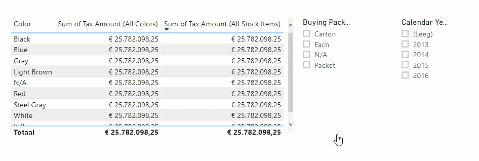

# Context - lab 1

Context is veruit het belangrijkste wat je gaat leren in deze cursus. Daarom is dit lab ook wat groter. We hebben het opgedeeld in drie "niveaus" - en we raden je aan om het van eenvoudig naar geavanceerd door te werken. Uiteraard kun je de instructievideo's terugkijken wanneer er iets niet helemaal duidelijk was.

Context is ook een complex onderwerp. Mocht er iets niet duidelijk zijn, trek direct even aan de bel!

## Voorbereiding

Open het Power BI bestand `34-filter-context-lab-groot`.

## Eenvoudige context-opdrachten

1. Maak een eenvoudige measure `Sum of Tax Amount`. Deze moet de som berekenen van de betaalde belasting op basis van de kolom `'Fact Sale'[Tax Amount]`
   * We passen hier nog niets expliciet aan de context aan
   * Controleer met een matrix of de measure uitsplitst `'Dimension Date'[Calendar Year]` (kolommen) en `'Dimension Stock Item'[Color]` (rijen)  

2. Maak een variant op deze measure, genaamd `Sum of Gray Tax Amount`. Deze moet de som berekenen van de betaalde belasting voor grijze producten, ongeacht welke kleur er op de rijen staat.
   * Je kunt de filter context aanpassen met de `CALCULATE` functie
   * Mocht je een geheugensteuntje nodig hebben: in de video zat een voorbeeld van deze measure die exact hetzelfde deed voor *rode* producten en *quantity*  

3. Maak een derde variant op deze measure, genaamd `Sum of Only Gray Tax Amount`. Wanneer de productkleur in de filter context niet "Gray" is, moet de tekst "Niet Grijs!" worden weergegeven.
   * Gebruik de functie `SELECTEDVALUE` om de geselecteerde waarde in de filtercontext te bepalen
   * Gebruik de functie `IF` om een keuze te maken
   * Je hoeft niet alle `CALCULATE`-code te herhalen voor de grijze producten - je kunt ook verwijzen naar je eerder ontwikkelde measure `[Sum of Gray Tax Amount]`  

4. Maak een nieuwe measure, genaamd `Sum of Abbottsburg Tax Amount`. Deze geeft de betaalde belasting voor `'Dimension City'[City]` **Abbottsburg**
5. Breid deze measure uit
   * Hernoem naar `Sum of Abbottsburg Red Tax Amount`
   * Filter naast Abbottsburg ook op `'Dimension Stock Item'[Color]` **Red**
   * Je kunt hiervoor in je `CALCULATE` statement eenvoudig de nieuwe aanpassing in je filtercontext toevoegen: `CALCULATE(SUM('Fact Sale'[Tax Amount]), filteraanpassing1, filteraanpassing2, filteraanpassing3, etc.)`
6. Breid deze measure nog één keer uit:
   * Hernoem naar `Sum of Abbottsburg Red Tax Amount 2015`
   * Filter naast Abbottsburg en Red ook op `'Dimension Date'[Calendar Year]` **2015**
   * Test de measure door in een matrix de twee nieuwe *measures* naast elkaar te zetten. Bedenk dat de weergaveinstellingen van je measure een afrondingsverschil kunnen geven (pas dit zonodig aan om te controleren of alles goed gaat):  

## Combineren van binnen- en buiten aangepaste context

We gaan nu opdrachten van binnen- en buiten de aangepaste context met elkaar combineren. Een voorbeeld hiervan is **percentage van het geheel**:

Om het percentage van de blauwe verkopen als aandeel van het geheel te berekenen moet het bedrag **binnen de filtercontext** (op het plaatje hierboven de groen omlijne `5.385.582,30`) gedeeld worden door een getal waar **waar de filter verwijderd is** (het rood omlijne `25.782.098,25`). Gelukkig is dat niet al te moeilijk binnen DAX. We pakken het allereerst stapsgewijs aan:

7. Maak een nieuwe measure met de definitie `Sum of Tax Amount (All Colors) = SUM('Fact Sale'[Tax Amount])`
8. Wijzig nu de filtercontext met behulp van `CALCULATE`.
   * Eerder hebben we filters *vervangen*. Dat deden we door een expressie als `'Dimension Stock Item'[Color] = "Red"`
   * Nu gaan we de filter *verwijderen*. Hiervoor gebruiken we de functie `ALL()`
   * `ALL()` kan zowel filters verwijderen van een enkele *kolom*, als van een gehele *tabel*. 
   * Voor nu kiezen we om heel specifiek de filter van kolom `'Dimension Stock Item'[Color]` te verwijderen
   * Dit kan met de expressie `ALL('Dimension Stock Item'[Color])`
9. Controleer de werking van je nieuwe measure door in een tabel de volgende drie velden op te nemen:
   * `'Dimension Stock Item'[Color]`
   * `Sum of Tax Amount`
   * `Sum of Tax Amount (All Colors)`  

10. Maak nu de measure `Pct of Tax Amount (All Colors)` die `Sum of Tax Amount` deelt door `Sum of Tax Amount (All Colors)`
    * Gebruik de functie `DIVIDE` voor de deling ([documentatie over Divide vind je hier](https://dax.guide/divide/))
11. Voeg nu alle code samen in de measure `Pct of Tax Amount (All Colors)`. Gebruik variabelen om de tussentijdse resultaten op te slaan.
12. Maak nu een measure `Sum of Tax Amount (All StockItems)`
    * Deze lijkt op `Sum of Tax Amount (All Colors)`, maar verwijdert alle filters van `'Dimension Stock Item'`, en niet enkel van `'Dimension Stock Item'[Color]`
    * Test de measures door een ze in een tabel naast elkaar te zetten. Kijk wat de invloed is op beide measures van een slicer op een andere kolom in `Dimension Stock Item` (dus niet `Color`).
    * Test nu ook met een slicer op een andere tabel. Zijn de resultaten zoals je verwacht?  

13. Maak nu de volgende (ietwat vreemde) measure met de naam `strange quantity measure`
    * We kijken naar de hoeveelheid verkochte producten: `'Fact Sale'[Quantity]`
    * Wanneer de cijfers waar we naar kijken over **blauwe** producten gaan, moeten de filter van `'Dimension Date'[Calendar Year]` verwijderd worden. De blauwe producten laten dus altijd de cijfers over alle jaren zien.
    * Wanneer de cijfers waar we naar kijken over **grijze** producten gaan, moeten de cijfers van de **rode** producten weergegeven worden.
    * In alle overige gevallen wordt de filter context intact gelaten
    * Maak gebruik van de kennis die je inmiddels hebt over:
      * `IF` (en geneste IF statements)
      * `SELECTEDVALUE`
      * `CALCULATE` in combinatie met `ALL`
      * `VAR` (**dit maakt het mogelijk om één van de hierboven benoemde voorwaarden "los" te testen!**)  

14. Maak een nieuwe *measure* aan met de naam *Sum of Profit in All Cities*
    * Zorg ervoor dat deze de winst weergeeft in alle steden (dus de filter die nu op Dimension City ligt moet verwijderd)
      * Controleer of deze werkt zoals verwacht door de kolom naast de bestaande *Profit*-kolom weer te geven. Hoe weet je of je het correcte getal hebt  uitgerekend?
      * Voeg een nieuwe *slicer* toe op basis van *Country*. Werkt de measure nog zoals verwacht?
      * Stel dat je nu dat je alleen alle steden wilt zien, maar de filter op *Country* wel wilt laten liggen, hoe los je dit op?
      * En andersom - als je op elke kolom waarop je kunt filteren in *Dimension City* de filters wilt negeren?
15. Maak een nieuwe measure *Percentage of Total Profit*, waarin de huidige winst (in een stad) wordt gedeeld door de totale winst. Gebruik de functie `DIVIDE`. Zorg ervoor dat deze als een percentage wordt weergegeven.
16. Maak een nieuwe measure *Y-Profits* aan.
    * Wanneer de geselecteerde stad met een **Y** begint, geef je de winst aan
    * In alle overige gevallen geef je een `BLANK()` terug
    * Gebruik de `MAX()`-functie om de huidige stad uit te lezen. Sla de waarde op in een `VAR`
    * Gebruik de `LEFT` functie om het eerste teken van de naam van een stad te achterhalen. 
    * Bekijk het resultaat.
      * Is dit als verwacht?
      * Verklaar de waarde van de **total** rij

## Geavanceerd / bonus-opdracht

Nog niet genoeg van de filter-context gekregen? We hebben hier nog een extra opdracht. Maak je geen zorgen wanneer je hier niet uitkomt - we komen er later in de cursus op terug!

In deze bonus-opdracht willen we graag een Year-to-Date measure maken, waarbij we gebruik maken van slechts drie DAX-functies:

* `CALCULATE`
* `SUM`
* `ALL`
* `MAX`
* Je mag de functie `YEAR` ook gebruiken, maar deze is niet per sé nodig.

Daarnaast gebruiken we de DAX-taalelementen als variabelen (`VAR` .. `RETURN`) en diverse logische operators.

Het doel is om de volgende werking gedaan te krijgen:

In het bovenliggende plaatje is de ProfitYTD op 4 januari de opgetelde winst van 1 + 2 + 3 + 4 januari. Met andere woorden: *alle datums tot en met vandaag, binnen het huidige jaar*. In een lijngrafiek zie je het verloop van een YTD door het jaar heen - elk jaar begint deze weer op 0:

Gebruik nu je eerder opgebouwde kennis om de YTD te bouwen met bovenstaande functies. Voordat je begint, nog één tip die je zeker gaat helpen:

**Bij een CALCULATE worden alle aanpassingen in de filter-context "afgespeeld" van links naar rechts. Je kunt dus eerst alle filters op een tabel verwijderen met `ALL('mijnTabel')`, en vervolgens binnen dezelfde tabel weer filters toepassen met `'mijnTabel'[MijnKolom] = "NieuwGefilterdeWaarde"`.**

Verder kun je handige tips vinden in de eerdere labs en demo's. Met name het lab van module 2 zou je verder kunnen helpen wanneer je vastloopt.

Nogmaals: geen zorgen wanneer dit niet lukt - vraag gerust om assistentie, we komen hier later in de cursus zeker op terug!
