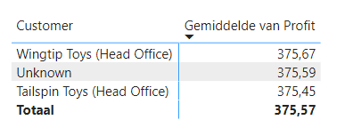

# Context Transition - self-paced demo

In this *self-paced demo*, we will further delve into the two contexts: *row context* and *filter context* - specifically, the *Context Transition*. There will be several demonstrations of applications involving this context transition.

## Context Transition and semi-additive measures

Suppose you are looking for the **average profit per customer**. Using an `AVERAGE` over `'Fact Sale'[Profit]` split by customers will not help you here, as it would give you the average profit *per sale*. And for each customer, there are (hopefully) multiple sales.



So how can we achieve the desired result? Here's how:

* We want the average profit per customer
* In other words, we want to sum up all sales for each customer and calculate the average from there
* To put it differently, if we *iterate* over our customers, we can then take the average of the sales *per customer*

You might come up with the following formula:

```dax
Semi-additive measure attempt 1 = AVERAGEX('Dimension Customer', SUM('Fact Sale'[Profit]))
```

In the above formula, we iterate over the table of customers, calculate the sum of profits per customer, and finally take the average.

However, when you try out this formula, you will see that it does not work quite as expected - it does not calculate the average of the total profits per customer:


The cause here is the fact that the `SUM` function does not understand the row context. And without that row context, `SUM` sees exactly the same as if `AVERAGEX` were not here: the implicit filter context of `Customer`, and when that is gone (on the grand total row) there is no filter context at all.

We can solve this by **context transition**: explicitly creating a new filter context within the row context. We do this by wrapping the `SUM` in the `CALCULATE` function:

```dax
Average profit per customer =
AVERAGEX ( 'Dimension Customer', CALCULATE ( SUM ( 'Fact Sale'[Profit] ) ) )
```

Now the average profit per customer comes out correctly:


## Context Transition and iterators

You won't apply context transition extremely often. However, when you want to use averages per category (as in the example above), you often need them.

Keep in mind that a context transition (in simple terms: `CALCULATE` within an iterator like `SUMX`, `AVERAGEX`, etc.) can negatively impact the performance of your data model. Don't let this hold you back too much, but think carefully about whether you can also solve things without context transition.

Even if you have performance problems and you use context transition, you still don't know for sure if that's the cause of your problem! To find out where the issue lies in a performance problem, further analysis is needed. There are various videos and tools available. In the following YouTube videos, you will find a few examples:

* [https://www.youtube.com/watch?v=eABg872TAJU](https://www.youtube.com/watch?v=eABg872TAJU)
* [https://www.youtube.com/watch?v=1lfeW9283vA](https://www.youtube.com/watch?v=1lfeW9283vA)
* [https://www.youtube.com/watch?v=B-h3Pohtn1Y](https://www.youtube.com/watch?v=B-h3Pohtn1Y)

In addition, there are also slightly more "deep dive" sessions (1 hour) from 2013 about the Tabular Model with performance tips that you can find here:

* [https://www.youtube.com/watch?v=dgzJPQ2-F5s](https://www.youtube.com/watch?v=dgzJPQ2-F5s)
