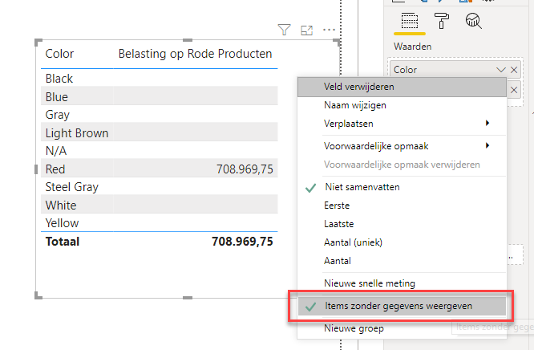

# Filtering - minilab 1

Open het bestand `51-filtering-minilab1.pbix`.

1. Maak een calculated table met de naam `Rode Producten`. Zorg er met DAX voor dat deze ook alleen rode producten bevat uit de tabel `Dimension Stock Item`
   * Controleer de resultaten in de data-weergave van Power BI
2. Maak in de tabel `Fact Sale` een calculated measure `Belasting op Rode Producten`. Zorg ervoor dat de som van `'Fact Sale'[Tax Amount]` wordt berekend, maar alleen voor de rode producten
   * Wanneer je in een tabel de kolom `'Dimension Stock Item'[Color]` uitzet tegen de nieuwe measure `[Belasting op Rode Producten]` moet alleen de kleur *Red* worden weergegeven:  

   * Wanneer je bij de kolom `[Color]` kiest voor "Items zonder gegevens weergeven", zie je dat de andere kleuren geen waarde hebben:  

3. Maak nu in de tabel `Fact Sale` een calculated measure `Belasting op Grijze Producten in 2013`.
   * Maak gebruik van een **matrix** en de functionaliteit **Items zonder gegevens weergeven** om de resultaten te controleren.  

