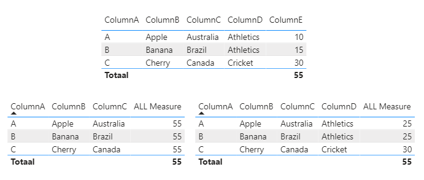

# Demo - ALL, ALLEXCEPT en ALLSELECTED

In deze "self-paced" demo verkennen we verschillende smaken van de `ALL` operator.
We doen dit met een eenvoudige tabel, die je zowel hieronder vindt als in het Power BI-bestand `53-guided-demo-allexcept-allselected.pbix`.

| ColumnA | ColumnB | ColumnC   | ColumnD   | ColumnE |
|---------|---------|-----------|-----------|---------|
| A       | Apple   | Australia | Athletics | 10      |
| B       | Banana  | Brazil    | Athletics | 15      |
| C       | Cherry  | Canada    | Cricket   | 30      |

## Voorbereiding

Open het bestand `53-guided-demo-allexcept-allselected`.

## ALL

De functie `ALL` hebben we eerder al gebruikt. Met wat we zojuist geleerd hebben over filters en de `FILTER`-functie kijken we hier opnieuw naar. Daarnaast gebruiken we onze kennis die we al over de `ALL` functie hebben om een measure te maken die we goed kunnen vergelijken met `ALLEXCEPT` en `ALLSELECTED`.

1. Maak een tabel aan waarin je alle kolommen van *Table1* naast elkaar zet  

2. Open [DAX Formatter](https://www.daxformatter.com/) en laat de volgende measure-definitie netjes opmaken:  
`ALL Measure = CALCULATE(SUM(Table1[ColumnE]); ALL(Table1[ColumnA]; Table1[ColumnB]; Table1[ColumnC]))`
3. Voer de - nu netjes opgemaakte - measuredefinitie in binnen het Power BI model.
4. Maak een **Table visualisatie** waarin je de volgende velden neerzet:
   * **ColumnA**
   * **ColumnB**
   * **ColumnC**
   * **ALL Measure**
5. **Kopieer en plak** de table visualisatie. **Voeg ColumnD toe**. Als het goed is staan er nu de volgende velden in de tweede table-visualisatie:
   * **ColumnA**
   * **ColumnB**
   * **ColumnC**
   * **ColumnD**
   * **ALL Measure**
6. Vergelijk de drie tabellen (de tabel met brondata vs. de twee tabellen met een `ALL` measure. Is het resultaat wat je verwachtte?  

> ### Hoe ziet de filter context eruit?
>
> Ook wanneer je de bovenstaande tabellen volledig logisch vindt, is het nog steeds nuttig om expliciet te benoemen wat hier gebeurt.
> `ALL` zorgde er hier voor dat de filters van de kolommen A t/m C verwijderd werden, maar D bleef staan. Dat zorgt voor de volgende uitkomsten:
>
> * Op de afbeelding hierboven de tabel **linksonder** bevat kolommen *ColumnA*, *ColumnB* en *ColumnC*. Anders gezegd: de filter context bestaat voor de eerste rij uit:
>   * ColumnA = "A"
>   * ColumnB = "Apple"
>   * ColumnC = "Australia"
> * Dit zijn exact de kolommen waarvan `ALL Measure` de filter verwijdert met de functie `ALL`. **`ALL` doet wat dat betreft dus exact het omgekeerde van `FILTER`: `FILTER` voegt filters toe, `ALL` verwijdert ze.**
> * Op de afbeelding hierboven de tabel **rechtsonder** bevat ook nog de kolom *ColumnD*. De `ALL measure` verwijdert hier geen filters van, dus die blijven intact.
>   * **Hoewel de tabel drie rijen kent, bestaat de filter context voor de `SUM` functie binnen `ALL Measure` nog maar uit één filter: de filter op `ColumnD`**
>   * Op regel 1 bestaat de filter context voor `SUM` uit één filter: `ColumnD = "Athletics"`
>     * Alle waarden waar dat geldt worden opgeteld: 10 + 15 = 25
>   * Op regel 2 gebeurt hetzelfde als op regel 1
>   * Op regel 3 bestaat de filter context voor `SUM` ook uit één filter: `ColumnD = "Cricket"`
>     * Er is maar één waarde voor Cricket: 30
>   * Op regel 4 (*Totaal*) is de filter context voor `SUM` leeg
>     * Er ligt in de totaalregel geen filter op `ColumnD` (en ook niet op de andere kolommen)
>     * Alle waarden in kolom `Table1[ColumnE]` worden dus opgeteld: 10 + 15 + 30 = 55

## ALLEXCEPT

De functie **ALL** verwijdert alle filters van de kolommen die je expliciet benoemt: `ALL(Table1[ColumnA])` verwijdert alle impliciete filters van `Table1[ColumnA]`. De functie **ALLEXCEPT** verwijdert juist de filters van kolommen die je *niet* expliciet benoemt. Je moet daarom wel zowel een tabel als minimaal één kolom benoemen.

7. Maak een nieuwe measure `ALLEXCEPT measure` met de volgende definitie:
   * `ALLEXCEPT Measure = CALCULATE ( SUM ( 'Table1'[ColumnE] ); ALLEXCEPT ( Table1; Table1[ColumnD] ) )`
8. Voeg de nieuwe measure toe aan de twee tabellen (zowel de tabel zónder, als de tabel mét ColumnD). Zoals je ziet functioneren deze exact hetzelfde.

`ALLEXCEPT` is strikt gezien een overbodige functie: alles wat je met `ALLEXCEPT` doet, kun je ook met `ALL`. Het maakt de leesbaarheid van je calculated measure echter een stuk beter.

## ALLSELECTED

