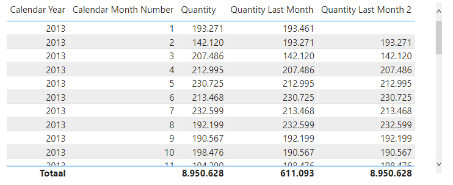

# Lab 2 - filtering

We're going to continue working with filtering and contexts.

## Preparation

Open the file '56-filtering-lab2.pbix'. On **Page 1** you will see the example that we just covered in the demo.

The `Running Total` measure has been slightly changed: a `FILTER` statement has been added. Because `CALCULATE` *replaces* filters on your columns - and that is not always desirable. `FILTER` allows you to *add filters* to existing filters. It is a good practice (and as you will quickly see, also necessary) to use `FILTER` in this way.

```dax
Running Total =
VAR CurrentYear = MAX('Dimension Date'[Date])
VAR RunningTotal = CALCULATE(SUM('Fact Sale'[Quantity]), FILTER(ALL('Dimension Date'), [Date] <= CurrentYear))
RETURN RunningTotal
```

## Running totals - continued

In the demo you just saw, a *Running Total* was created. It is also displayed on **Page 1** of the Power BI report you just opened. However, as you can see, we're not quite there yet. When I specify in a slicer that I only want to display the years 2014-2016, I see that the measure *Running Total* also includes 2013:


1. Modify the **Running Total** measure so that the Running Total starts at the first displayed year:


2. Now, copy the definition of the measure to a `Running Total Without Filter` measure and remove the `FILTER` statement. As you can see, your solution no longer works.
   * Can you explain what is happening?
   * Remember that `CALCULATE` always *replaces* filters.
   * Can you also explain why introducing `FILTER` provides a solution here?

## Year-to-date

A *Year-to-date* is essentially the same as a **Running Total**, but with one important difference: the running total doesn't go back indefinitely, but only until the beginning of the year.

Switch to **Page 2** in the Power BI report `56-filtering-lab2`. Here, you will see a table with four fields:

* Calendar Year
* Month
* Date
* Quantity
3. Create a new measure `My YTD` to build a year-to-date functionality:
   * Use the previously developed running total as a basis.
   * Expand it with a `VAR` that determines the current year in the context.
   * Extend `VAR RunningTotal` so that the running total starts at 0 again each year.
   * Verify the results in the table and with a line chart.


4. Now create a measure `My MTD` to perform a month-to-date calculation:
   * If you found YTD easy, try this without looking at `RunningTotal`.
   * Verify it again using the table and a line chart. Additionally, use the existing slicer to select `[Calendar Year] = 2015`.


5. Can you also create a running total over alphabetically sorted products? In other words, instead of adding all previous sales together (over time), you add all previous products (in an alphabetical list)?

## TOTALYTD

A simpler way to calculate YTD is to use `TOTALYTD`.

6. Create a new measure `My TotalYTD` and calculate the YTD:
   * Refer to [https://dax.guide/](https://dax.guide/) for the definition of `TotalYTD`.
## Measures that look at the previous month

Another common question is to be able to compare periods with each other. Switch to **Page 3**. Here you will see a table with three columns:

* Calendar Year
* Calendar Month Number
* Quantity

7. Create a new measure `Quantity Last Month` that displays the quantity of products sold one month ago
   * The measure only needs to work in this specific table
   * If it's difficult: Try working in small steps
     * For example, you can first create a measure that exactly returns the sold quantities
     * Then you can adjust it to always return the sales of March
     * Additionally, use the following variables as a starting point:
       * `VAR CurrentDate = MAX('Dimension Date'[Date])`
       * `VAR CurrentMonth = MONTH(CurrentDate)`
   * Use the `EDATE()` function to determine the previous month
8. You can also solve this function a lot easier with `PARALLELPERIOD`. Create a new measure `Quantity Last Month 2` that has the same functionality as `Quantity Last Month`. Search online for documentation and/or examples of `PARALLELPERIOD` to achieve this.


