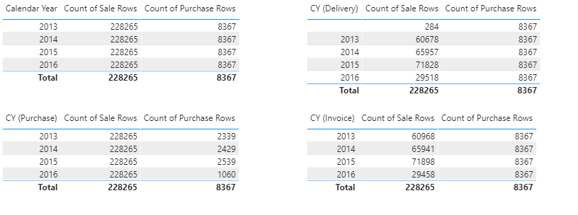

# Minilab - inactieve relaties, sort by column, automatic date table

## Inactieve relaties

Binnen Power BI kunnen er meerdere relaties bestaan tussen twee tabellen. Vaak is dit het geval bij een Datum-dimensie.

1. Maak een nieuwe measure `Count of Invoice Rows`, waarin je het aantal rijen binnen `Sale` telt
1. Visualiseer deze measure per `Date[Calendar Year]`
   * Welke relatie wordt op de achtergrond door DAX gebruikt?
1. Maak een tweede measure `Count of Delivery Rows`. Deze moet opnieuw het aantal rijen binnen `Sale` tellen, maar deze keer gebruik maken van de relatie van `Date[Date]` naar `Sale[Delivery Date Key]`.
   * Je kunt dit doen met behulp van de functie `USERELATIONSHIP`
   * Documentatie en voorbeelden zijn veelvuldig te vinden op internet :)

## Alternatief: meerdere date tables

Het nadeel van het gebruik van meerdere relaties, is dat binnen een measure aangegeven moet worden welke relatie er gebruikt moet worden. Ook is het niet mogelijk om bijvoorbeeld in een matrix de *invoice date* op de rijen uit te zetten tegen de *delivery date* op de jaren - zoals hieronder:

Een alternatief is om een datumtabel simpelweg meerdere keren in te laden. In plaats van een tabel `Date` krijg je dan een tabel `Delivery Date`, een tabel `Invoice Date`, etc..

4. Maak een nieuwe *calculated table* met de naam `Delivery Date`. De inhoud mag exact hetzelfde zijn als de tabel `Date`
1. Doe ditzelfde voor een nieuwe tabel `Invoice Date`
1. Maak relaties aan tussen `Sale` en de nieuwe tabellen
1. Verwijder de relaties tussen `Date` en `Sale`
1. Maak een nieuwe measure met de naam `Count of Sale Rows` aan
1. Controleer of de uitkomsten hetzelfde zijn als bij de `USERELATIONSHIP` aanpak.

10. Maak nu de matrix met *invoice year* vs. *delivery year* als hieronder:

Het opsplitsen in aparte datumdimensies maakt het mogelijk om meerdere datumlijnen met elkaar te vergelijken.

Een nadeel van deze aanpak is dat niet alles aan een *Order*, danwel *Invoice* date opgehangen kan worden: Wanneer een nieuwe tabel met inkopen zou worden toegevoegd, heb je opeens een inkoopdatum

Je kunt deze natuurlijk opnieuw aan een eigen datumtabel koppelen. Dat maakt het echter lastig om door de tijd heen in één overzicht zowel de verkopen als de inkopen voor een jaar weer te geven.

11. Voeg aan je datamodel data over inkopen toe. Deze is te vinden in de map `csv`, bestand `Fact.Purchase.csv`
1. Zoals je ziet heeft de tabel *Purchase* slechts één datumkolom. 
1. Maak een nieuwe datumtabel met de naam *Purchase Date*. De inhoud mag hetzelfde zijn als de *Date* tabel.
1. Maak een relatie tussen *Purchase* en *Purchase Date*
1. Maak een measure `Count of Purchase rows`
1. Probeer nu in één tabel `Count of Purchase rows` en `Count of Sale Rows` uit te splitsen over `Calendar Year`. Probeer de diverse datumtabellen uit en bekijk de resultaten.

Je kunt dit deels ondervangen door alle tabellen met een relatie te koppelen aan de oorspronkelijke `Date` tabel.

17. Voeg nieuwe relaties toe tussen de nieuwe tabellen (`Invoice Date`, `Delivery Date`, `Purchase Date` ) en `Date`.
1. Zoals je ziet zal ook nu slechts één van de relaties als **active** aangemerkt zijn. Zorg ervoor dat dit `Invoice Date` is.
1. Verander de relaties van `1:1` naar `1:n` (waarbij `Date` de `1`-zijde is) en kies voor een éénrichtingsfilter
1. Controleer de werking met een nieuwe tabel waarin je `'Date'[Calendar Year]` uitzet tegen:
   * `Count of Invoice Rows`
   * `Count of Purchase Rows`  

1. Pas de measure `Count of Delivery Rows` aan zodat deze weer correct werkt en voeg deze ook aan de tabel toe.

Zoals je ziet kun je met wat pijn en moeite meer functies aan de datumtabellen toevoegen. In de praktijk wordt dit echter niet veel toegepast - het model wordt er niet bepaald begrijpelijker op met vijf datumtabellen...

> ### 1:n
>
> Het aanpassen van de `1:1` relatie zojuist was voor het datamodel strikt gezien niet nodig: de datum is aan beide zijden van de relatie uniek. Wanneer er echter een `1:1` relatie is, werkt `USERELATIONSHIP` niet helemaal zoals je zou verwachten. De laatste stap (het aanpassen van `Count of Delivery Rows`) was je dan niet gelukt.
